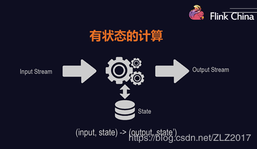
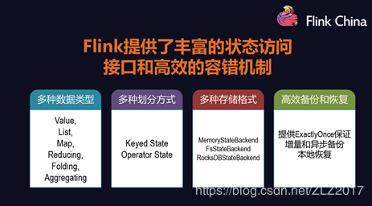
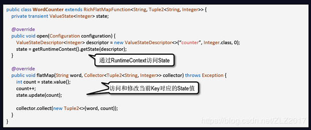
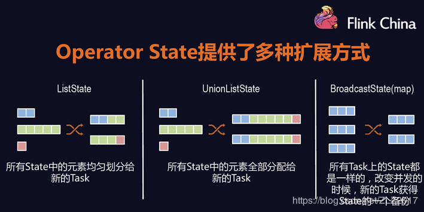
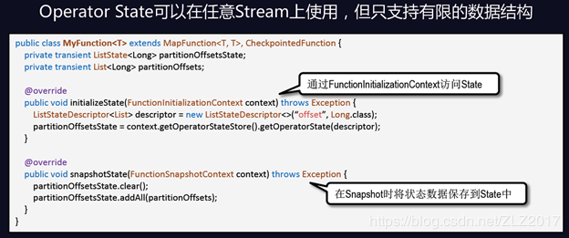
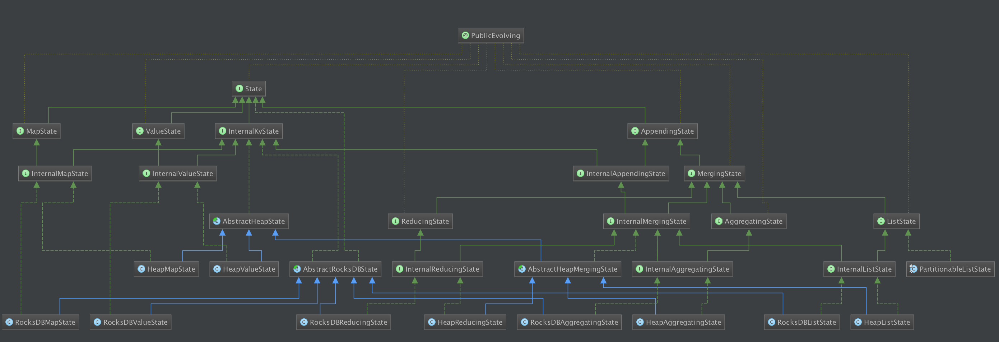

 Flink Application
-

1. 了解 Flink 应用开发需要先理解 Flink 的 Streams、State、Time 等基础处理语义以及 Flink 兼顾灵活性和方便性的多层次 API。

    - Streams：流，分为有限数据流与无限数据流，unbounded stream 是有始无终的数据流，即无限数据流；而 bounded stream 是限定大小的有始有终的数据集合，即有限数据流，二者的区别在于无限数据流的数据会随时间的推演而持续增加，计算持续进行且不存在结束的状态，相对的有限数据流数据大小固定，计算最终会完成并处于结束的状态。
    
    - State，状态是计算过程中的数据信息，在容错恢复和 Checkpoint 中有重要的作用，流计算在本质上是 Incremental Processing，因此需要不断查询保持状态；另外，为了确保 Exactly- once 语义，需要数据能够写入到状态中；而持久化存储，能够保证在整个分布式系统运行失败或者挂掉的情况下做到 Exactly- once，这是状态的另外一个价值。
    
    - Time，分为 Event time、Ingestion time、Processing time，Flink 的无限数据流是一个持续的过程，时间是我们判断业务状态是否滞后，数据处理是否及时的重要依据。
    
    - API，API 通常分为三层，由上而下可分为 SQL / Table API、DataStream API、ProcessFunction 三层，API 的表达能力及业务抽象能力都非常强大，但越接近 SQL 层，表达能力会逐步减弱，抽象能力会增强，反之，ProcessFunction 层 API 的表达能力非常强，可以进行多种灵活方便的操作，但抽象能力也相对越小。
 
      
    图1 有状态的计算
    
如果一个task在处理过程中挂掉了，那么它在内存中的状态都会丢失，所有的数据都需要重新计算。从容错和消息处理的语义上(at least once, exactly once)，Flink引入了state和checkpoint。

首先区分一下两个概念，state一般指一个具体的task/operator的状态。而checkpoint则表示了一个Flink Job，在一个特定时刻的一份全局状态快照，即包含了所有task/operator的状态。

Flink通过定期地做checkpoint来实现容错和恢复。
    
一、 State
- 
1. 状态类型    

    Flink中包含两种基础的状态：Keyed State和Operator State。

    - Keyed State
        -  Keyed state是基于KeyedStream上的状态，这个状态与特定的key绑定。对于KeyedStream流上每一个key都对应一个state(一个Task可能包含多个Key，不同的Task上不会出现相同的Key)。
          
          当前Flink提供的Keyed state数据结构是: ValueState<T>、ListState<T>、ReduceState<T>、MapState<T>。
    
    - Operator State
        - Operator state跟一个特定的Operator的一个并发实例绑定，一个task对应一个state。
          当前Flink提供的Operator state数据结构是: ListState<T>
          
         举例来说，Flink中的Kafka Connector，就使用了operator state。它会在每个connector实例中，保存该实例中消费topic的所有(partition, offset)映射。
    -   
    图2 状态类型
    
2. Keyed state
    -    
    
3. Operator state
    -   
    -    

4. 原始状态和Flink托管状态 (Raw and Managed State)
    - Keyed State和Operator State，可以以两种形式存在：原始状态和托管状态。   
        托管状态是由Flink框架管理的状态，如ValueState, ListState, MapState等。
    -     
    而raw state即原始状态，由用户自行管理状态具体的数据结构，框架在做checkpoint的时候，使用byte[]来读写状态内容，对其内部数据结构一无所知。通常在DataStream上的状态推荐使用托管的状态，当实现一个用户自定义的operator时，会使用到原始状态。
    
5. Checkpoint

    - Checkpoint是Flink管理状态容错的手段，检查点允许Flink恢复流中的状态及位置，从而是应用程序正确无误的运行。默认情况下，禁用检查点，状态保存在TaskManager的内存中，检查点存储在JobManager内存中。
    
    - Checkpoint是Flink中轻量级的分布式异步快照的机制。Flink流式计算模型中包含Source Operator、Transformation Operators、Sink Operator等三种不同类型的节点，分别负责数据的输入、处理、和输出，对应计算拓扑的起点、中间节点和终点。Flink分布式快照的核心是Barrier，这些Barrier周期性的被注入到数据流并作为数据流的一部分流入到到所有的Source中，Source节点看到Barrier后，会立即记录自己的状态，然后将Barrier发送到Transformation Operator；当Transformation Operator从某个input channel收到Barrier后，它会立刻Block住这条通道，直到所有的input channel都收到Barrier，此时该Operator就会记录自身状态，并向自己的所有output channel广播Barrier。Sink接受Barrier的操作流程与Transformation Oper一样。当所有的Barrier都到达Sink之后，并且所有的Sink也完成了Checkpoint，这一轮Snapshot就完成了。
    
    - Block Input实际上是有负面效果的，一旦某个input channel发生延迟，Barrier迟迟未到，这会导致Transformation Operator上的其它通道全部堵塞，系统吞吐大幅下降。但是这么做的一个最大的好处就是能够实现Exactly Once。不过Flink还是提供了选项，可以关闭Exactly once并仅保留at least once，以提供最大限度的吞吐能力。

